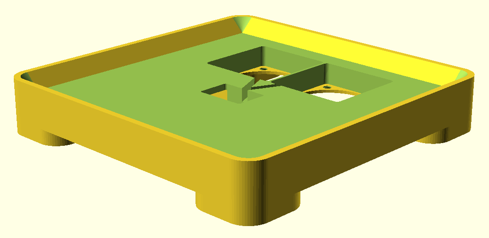
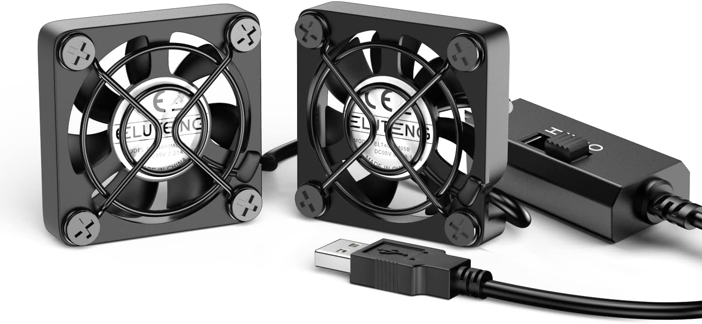

# hm90-fan-riser
This is a base stand to hold fans under an HM90 Minisforum computer with 1 HDD installed.

The Minisforum HM90 computer has a major flaw with cooling where the lower half of the computer is not cooled with fans nor convection. I am seeing the temperature of my 4TB flash overheat along with the HDD. This riser/stand was built to hold two 40mm fans, each placed to generate airflow in opposite directions to help circulate air to remove heat from the flash heatsink and HDD.

At the time of this creation, commercial cooling units are mostly designed for laptops typically with fans moving air in the same direction.

## Parts Procured
* USB dual fans with speed control (fan grates removed before utilization):
	* "ELUTENG Dual 40mm USB Fan with 3 Speeds Adjustable 5V PC Fan Max 5500RPM 40mm * 40mm * 25mm Mini Case Fan Quiet Computer Fan Compatible for PC, TV Box, Router, Xbox, Playstation"
	* Amazon link: https://www.amazon.com/dp/B08ZY7X4CR

## Design & Assembly Notes
* Print and assemble the layers.
	* There is a pre-cut project file with alignment pegs: `hm90-fan-riser-precut.3mf`
	* Be careful to not let the PETG or other material warp during cooling.
	* Be careful assembling the top two sections to not break the thin wall in between the fans.
* Remove screws and fan grates.
* Feed through the USB wire and control switch through the top center cutout.
* Place fans in opposite directions to maximize air flow throught the hm90 chassis.
* Place HM90 on top (there should be a minimal air gap to maximize the air flow through the HM90 vent).
* Plug in the fans to a USB adapter (or the computer if the computer's power is not overly taxed).

## 3D Printing
Settings used in development:

* 0.4mm nozzle
* PETG (less potential warping from heat compared to PLA)
* 0.28mm layer height
* 15% infill (structural strength, warp reduction, and air gap heat insulating)
* support not required due to slicing

The printing parameters should be flexible for change and provide good results.

## Final Comments
The hm90-fan-riser cooled my NVMe M.2 flash memory by 16°C with the fans high!

There is room for improvement (cable management, USB drive holder, etc.), but you know... 80/20.

Waiting for 3D prints is the new waiting for downloads over a 56K baud modem. Just saying.

